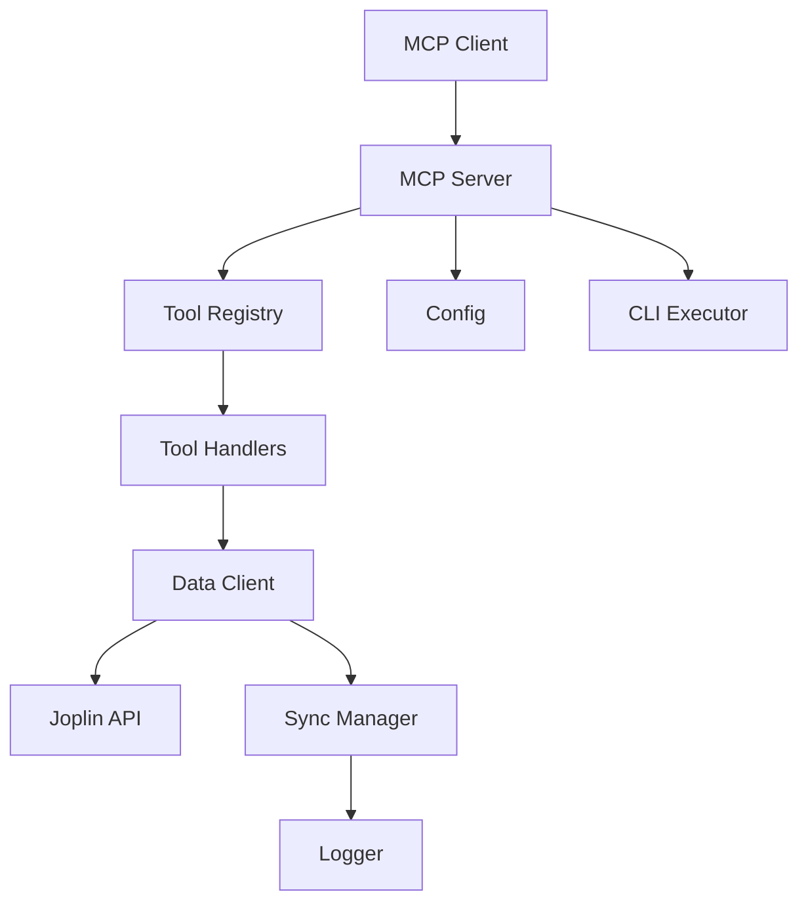

# Code Review Report — Pass #3

> **Review Date:** 2026-06-17
>
> **Note:** This is the third code review pass. Previous findings from Pass #1 and Pass #2 have been addressed.

---

## Executive Summary

This report covers **17 findings** (1 CRITICAL, 5 HIGH, 7 MEDIUM, 4 LOW) across five categories: Security, Code Quality & Best Practices, Code Documentation, Tests, and Usage & Test Documentation. The codebase remains well-structured and maintainable. The `GuardedString` utility exists but requires broader adoption, and several incremental improvements would further harden security and maintainability. No architectural red flags were identified.

---

## What's Working Well (Strengths)

- **Solid TypeScript strict mode** usage across the entire codebase.
- **Good test coverage** for unit tests in [`tests/`](tests/), with well-structured test suites.
- **Clean separation of concerns** between [`src/data-client.ts`](src/data-client.ts), [`src/mcp/tools.ts`](src/mcp/tools.ts), and [`src/server.ts`](src/server.ts).
- **Proper error classification** with custom error types defined in [`src/errors.ts`](src/errors.ts).
- **`GuardedString` implementation exists** in [`src/guarded-string.ts`](src/guarded-string.ts) — it just needs to be used more broadly.
- **Good signal handling** for graceful shutdown in [`src/server.ts`](src/server.ts).
- **Pagination utilities** are well-tested in [`tests/pagination.test.ts`](tests/pagination.test.ts).
- **ESLint configuration** with security-focused rules in [`eslint.config.mjs`](eslint.config.mjs).

---

## 🔴 SECURITY (Highest Priority)

### CRITICAL-001: Token Stored in Memory Without Encryption

- **File:** [`src/data-client.ts`](src/data-client.ts) (around line 58–74)
- **Severity:** 🔴 CRITICAL

The Joplin authentication token is stored as a plain string in memory:

```typescript
private token: string | null;
```

While [`GuardedString`](src/guarded-string.ts) exists in the codebase, it is not used for the API token. A memory dump or debug log could expose the plaintext token.

**Recommendation:** Replace `private token: string | null` with `private token: GuardedString | null` and use `.getValue()` when the token value is needed for API calls.

---

### HIGH-002: No Token Expiration Enforcement

- **File:** [`src/data-client.ts`](src/data-client.ts) (around line 79–99)
- **Severity:** 🟠 HIGH

The `fetchToken()` method stores the token but does not validate or enforce the `expires_at` field returned from the Joplin auth response. Tokens could be used indefinitely after server-side expiration.

**Recommendation:** Store the `expires_at` timestamp and implement an `isTokenExpired()` check before each API call. Automatically refresh or reject requests when the token is expired.

```typescript
private tokenExpiresAt: Date | null = null;

private isTokenExpired(): boolean {
  if (!this.tokenExpiresAt) return true;
  return new Date() >= this.tokenExpiresAt;
}
```

---

### HIGH-003: CLI Arguments Not Validated Against Shell Injection

- **File:** [`src/cli-executor.ts`](src/cli-executor.ts) (around line 65–88)
- **Severity:** 🟠 HIGH

The `validateArgs()` method checks for empty strings but does not validate against dangerous shell injection characters such as `;`, `|`, `&`, `$()`, or backticks.

**Recommendation:** Add a regex blacklist for dangerous characters and reject arguments containing them:

```typescript
const DANGEROUS_CHARS = /[;&|`$(){}[\]\\]/;
if (DANGEROUS_CHARS.test(arg)) {
  throw new ValidationError('Argument contains prohibited characters');
}
```

---

### MEDIUM-004: Error Messages May Leak Internal Paths

- **File:** [`src/data-client.ts`](src/data-client.ts) (around line 109–175)
- **Severity:** 🟡 MEDIUM

The `request()` method includes the full URL in error messages for some status codes. URLs are sanitized for 404/409 but not consistently for all error paths (e.g., 500, 502, 503).

**Recommendation:** Consistently sanitize URLs in all error responses to prevent internal path exposure. Strip query parameters and base path before including URLs in error messages.

---

## 🟡 CODE QUALITY & BEST PRACTICES

### HIGH-005: Missing Input Validation on Tool Handlers

- **File:** [`src/mcp/tools.ts`](src/mcp/tools.ts) (around line 38–46)
- **Severity:** 🟠 HIGH

The `searchNotes` handler does not validate the `query` parameter for emptiness before passing it to the data client. An empty or whitespace-only query could produce unexpected results or unnecessary server load.

**Recommendation:** Add validation before delegating to the data client:

```typescript
if (!input.query || input.query.trim() === '') {
  throw new ValidationError('Search query cannot be empty');
}
```

---

### MEDIUM-006: No Rate Limiting on API Calls

- **File:** [`src/data-client.ts`](src/data-client.ts) (around line 109–175)
- **Severity:** 🟡 MEDIUM

The data client has no rate limiting mechanism. Rapid successive calls — especially from paginated operations — could overwhelm the Joplin server.

**Recommendation:** Implement a simple rate limiter or request queue with configurable concurrency, such as a token-bucket or sliding-window limiter.

---

### MEDIUM-007: Incomplete Error Context in Sync Manager

- **File:** [`src/sync-manager.ts`](src/sync-manager.ts) (around line 105–131)
- **Severity:** 🟡 MEDIUM

When `runSync()` fails, the error is caught and logged but the error details are not preserved for later programmatic inspection. Consumers cannot query the most recent sync failure reason.

**Recommendation:** Store the last error and expose it:

```typescript
private lastError: string | null = null;

getLastError(): string | null {
  return this.lastError;
}
```

---

### LOW-008: Magic Numbers in Server Startup

- **File:** [`src/server.ts`](src/server.ts) (around line 72–137)
- **Severity:** 🟢 LOW

The `startDataApiServer` function uses magic numbers for retry logic (30 retries, 2000ms delay, 2000ms timeout).

**Recommendation:** Extract into a named constant object:

```typescript
const STARTUP_CONFIG = {
  maxRetries: 30,
  retryDelayMs: 2000,
  requestTimeoutMs: 2000,
} as const;
```

---

## 🔵 CODE DOCUMENTATION

### MEDIUM-009: Missing JSDoc on Public APIs

- **Files:** Multiple source files
- **Severity:** 🟡 MEDIUM

Several public methods lack JSDoc documentation:

| File                                                              | Methods Affected                                                                                  |
| ----------------------------------------------------------------- | ------------------------------------------------------------------------------------------------- |
| [`src/data-client.ts`](src/data-client.ts) (around line 183–312)  | All CRUD methods (`getNotes`, `getNote`, `createNote`, `updateNote`, `deleteNote`, `searchNotes`) |
| [`src/sync-manager.ts`](src/sync-manager.ts) (around line 33–131) | All sync methods (`triggerSync`, `runSync`, `getSyncStatus`)                                      |
| [`src/cli-executor.ts`](src/cli-executor.ts) (around line 90–157) | CLI execution methods (`execute`, `validateArgs`)                                                 |

**Recommendation:** Add JSDoc to all public methods with `@param`, `@returns`, and `@throws` tags.

---

### LOW-010: No Architecture Documentation

- **Severity:** 🟢 LOW

The project lacks an architecture overview document explaining component interactions, data flow, security model, and deployment architecture.

**Recommendation:** Create [`docs/ARCHITECTURE.md`](docs/ARCHITECTURE.md) with Mermaid diagrams showing:



---

## 🟢 TESTS

### HIGH-011: Missing Integration Tests

- **Severity:** 🟠 HIGH

All tests are unit tests with mocked dependencies. There are no integration tests that verify actual Joplin API interaction or end-to-end tool execution. This means regressions in real API interaction patterns may go undetected.

**Recommendation:** Add an integration test suite (run separately with an environment flag, e.g., `RUN_INTEGRATION_TESTS=true`) covering:

- Authentication flow (token acquisition, refresh, expiry)
- Note CRUD operations against a real or containerized Joplin instance
- Search with various query patterns
- Pagination with real data

---

### MEDIUM-012: Incomplete Error Path Coverage

- **File:** [`tests/data-client.test.ts`](tests/data-client.test.ts) (around line 633–762)
- **Severity:** 🟡 MEDIUM

Error classification tests do not cover all HTTP status codes. Missing cases include:

- `403 Forbidden`
- `429 Too Many Requests`
- `502 Bad Gateway`
- `503 Service Unavailable`

**Recommendation:** Add test cases for the missing HTTP error status codes to ensure proper error classification and handling.

---

### MEDIUM-013: No Concurrency Tests

- **File:** [`tests/sync-manager.test.ts`](tests/sync-manager.test.ts) (around line 163–235)
- **Severity:** 🟡 MEDIUM

While `triggerSync` serialization is tested, there are no tests for concurrent API calls from multiple tool handlers. Concurrent invocations could expose race conditions in the sync manager or data client.

**Recommendation:** Add concurrency tests that simulate multiple simultaneous tool invocations, verifying correct serialization and absence of race conditions.

---

### LOW-014: Missing Edge Case Tests

- **Severity:** 🟢 LOW

Several edge cases are untested:

| Edge Case                                             | Risk                               |
| ----------------------------------------------------- | ---------------------------------- |
| Empty string IDs                                      | Unexpected API behavior or crashes |
| Unicode characters (emojis, RTL text) in note content | Encoding issues                    |
| Very large notes (>1MB)                               | Memory or timeout issues           |
| Network timeout scenarios                             | Unhandled promise rejections       |

**Recommendation:** Add dedicated edge case tests for each identified scenario.

---

## 📚 USAGE & TEST DOCUMENTATION

### HIGH-015: README Missing Security Considerations

- **File:** [`README.md`](README.md)
- **Severity:** 🟠 HIGH

The README does not document token handling, network requirements, or security best practices for operators deploying this server.

**Recommendation:** Add a **"Security Considerations"** section covering:

- Token management and the `JOPLIN_TOKEN` environment variable
- Recommended network security posture (TLS, localhost-only by default)
- Environment variable handling (no hardcoded secrets)
- Token rotation best practices

---

### MEDIUM-016: No Troubleshooting Guide

- **Severity:** 🟡 MEDIUM

The documentation lacks a troubleshooting section for common issues:

- Authentication failures (invalid/expired tokens)
- Sync conflicts
- Connection timeouts
- CLI execution errors

**Recommendation:** Add a troubleshooting section to [`README.md`](README.md) or create [`docs/TROUBLESHOOTING.md`](docs/TROUBLESHOOTING.md).

---

### LOW-017: Missing API Reference in README

- **Severity:** 🟢 LOW

The README lists available tools but does not document input/output schemas, error responses, or rate limits.

**Recommendation:** Expand the README tools section with full input/output schema documentation, including parameter types, return types, and common error responses.

---

## 📊 Summary by Severity

| Severity    | Count | Categories                                          |
| ----------- | ----- | --------------------------------------------------- |
| 🔴 CRITICAL | 1     | Security                                            |
| 🟠 HIGH     | 5     | Security (2), Code Quality (1), Tests (1), Docs (1) |
| 🟡 MEDIUM   | 7     | Security (1), Code Quality (2), Docs (2), Tests (2) |
| 🟢 LOW      | 4     | Code Quality (1), Docs (1), Tests (1), Docs (1)     |

---

## 🎯 Top 5 Recommendations (Priority Order)

1. **Use GuardedString for token storage** ([CRITICAL-001](#critical-001-token-stored-in-memory-without-encryption)) — Immediate security improvement; the `GuardedString` class already exists and only needs to be wired in.
2. **Add token expiration enforcement** ([HIGH-002](#high-002-no-token-expiration-enforcement)) — Prevents use of stale tokens after server-side expiration, reducing auth failure noise.
3. **Validate CLI arguments against injection** ([HIGH-003](#high-003-cli-arguments-not-validated-against-shell-injection)) — Closes a shell injection gap in the CLI executor with a simple regex check.
4. **Add JSDoc to all public APIs** ([MEDIUM-009](#medium-009-missing-jsdoc-on-public-apis)) — Improves maintainability and developer experience with minimal effort.
5. **Create architecture documentation** ([LOW-010](#low-010-no-architecture-documentation)) — Helps new contributors and operators understand the system's component relationships and data flow.

---

## 📋 Full Findings Index

| ID           | Severity    | Title                                               | File(s)                                                    |
| ------------ | ----------- | --------------------------------------------------- | ---------------------------------------------------------- |
| CRITICAL-001 | 🔴 CRITICAL | Token Stored in Memory Without Encryption           | [`src/data-client.ts`](src/data-client.ts)                 |
| HIGH-002     | 🟠 HIGH     | No Token Expiration Enforcement                     | [`src/data-client.ts`](src/data-client.ts)                 |
| HIGH-003     | 🟠 HIGH     | CLI Arguments Not Validated Against Shell Injection | [`src/cli-executor.ts`](src/cli-executor.ts)               |
| MEDIUM-004   | 🟡 MEDIUM   | Error Messages May Leak Internal Paths              | [`src/data-client.ts`](src/data-client.ts)                 |
| HIGH-005     | 🟠 HIGH     | Missing Input Validation on Tool Handlers           | [`src/mcp/tools.ts`](src/mcp/tools.ts)                     |
| MEDIUM-006   | 🟡 MEDIUM   | No Rate Limiting on API Calls                       | [`src/data-client.ts`](src/data-client.ts)                 |
| MEDIUM-007   | 🟡 MEDIUM   | Incomplete Error Context in Sync Manager            | [`src/sync-manager.ts`](src/sync-manager.ts)               |
| LOW-008      | 🟢 LOW      | Magic Numbers in Server Startup                     | [`src/server.ts`](src/server.ts)                           |
| MEDIUM-009   | 🟡 MEDIUM   | Missing JSDoc on Public APIs                        | Multiple files                                             |
| LOW-010      | 🟢 LOW      | No Architecture Documentation                       | N/A (new file)                                             |
| HIGH-011     | 🟠 HIGH     | Missing Integration Tests                           | `tests/`                                                   |
| MEDIUM-012   | 🟡 MEDIUM   | Incomplete Error Path Coverage                      | [`tests/data-client.test.ts`](tests/data-client.test.ts)   |
| MEDIUM-013   | 🟡 MEDIUM   | No Concurrency Tests                                | [`tests/sync-manager.test.ts`](tests/sync-manager.test.ts) |
| LOW-014      | 🟢 LOW      | Missing Edge Case Tests                             | Multiple test files                                        |
| HIGH-015     | 🟠 HIGH     | README Missing Security Considerations              | [`README.md`](README.md)                                   |
| MEDIUM-016   | 🟡 MEDIUM   | No Troubleshooting Guide                            | [`README.md`](README.md) / docs                            |
| LOW-017      | 🟢 LOW      | Missing API Reference in README                     | [`README.md`](README.md)                                   |
