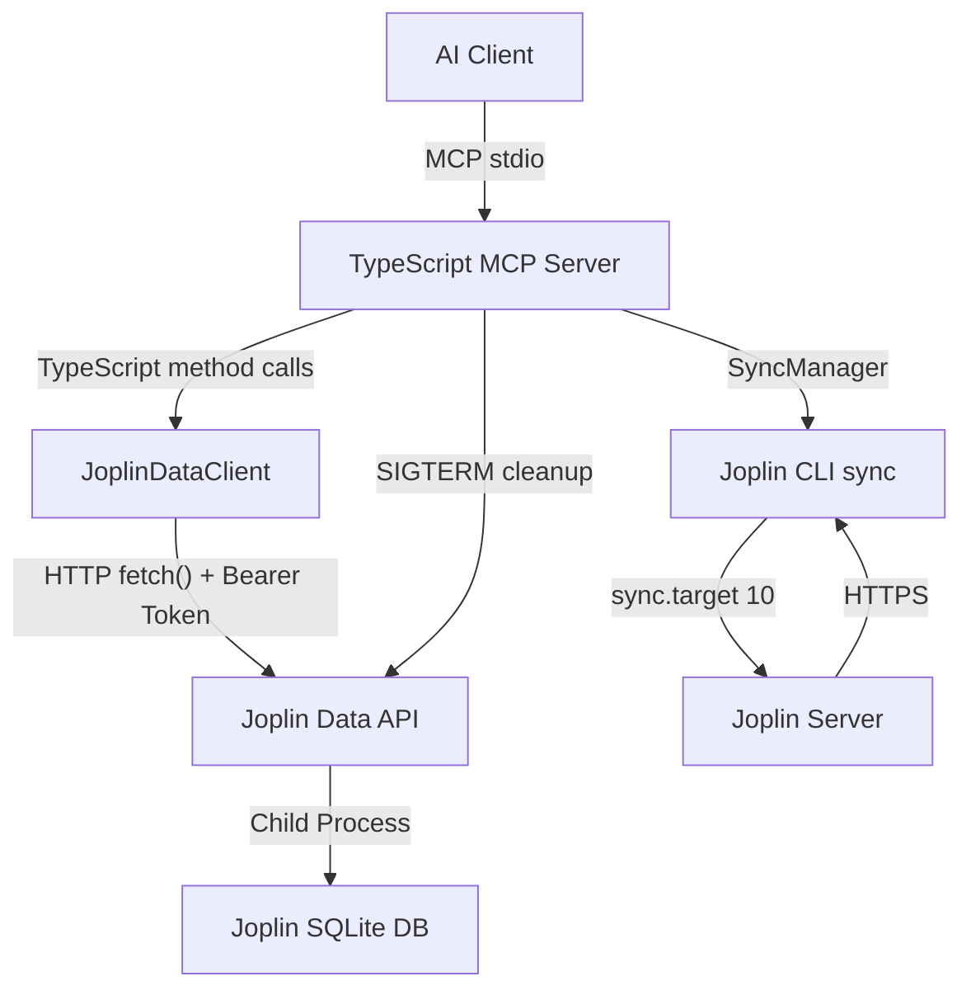

# Joplin API MCP Server

An MCP (Model Context Protocol) server that exposes Joplin's note-taking functionality — notes, folders, tags, search, and sync — to AI assistants via 16 tools.

## tl;dr / Quick Start

### Direct Installation

**Prerequisites:** Node.js 20+, [pnpm](https://pnpm.io/) 9+, a running [Joplin](https://joplinapp.org/) desktop app with the Data API enabled (Web Clipper → Options → Enable Clipper Server), and optionally [Joplin Server](https://github.com/laurent22/joplin/blob/dev/packages/server/README.md) for sync.

```bash
git clone <repo-url> && cd joplin-api
cp .env.example .env   # fill in JOPLIN_SERVER_URL, JOPLIN_USERNAME, JOPLIN_PASSWORD
pnpm install
pnpm build && pnpm start
```

Add this to your MCP client config (Claude Desktop, VS Code, etc.):

```json
{
  "mcpServers": {
    "joplin": {
      "command": "node",
      "args": ["/path/to/joplin-api/dist/server.js"],
      "env": {
        "JOPLIN_SERVER_URL": "https://joplin.example.com/",
        "JOPLIN_USERNAME": "your-email@example.com",
        "JOPLIN_PASSWORD": "your-password"
      }
    }
  }
}
```

> See [MCP Client Configuration](#mcp-client-configuration) below for Docker-based and other client setups.

### Docker

```bash
cp .env.example .env   # fill in required variables
docker compose up -d   # or `docker-compose up -d`
```

The `.env` file is automatically picked up by [`docker-compose.yml`](docker-compose.yml). The server starts in the background and listens on stdio for MCP requests.

---

## Detailed How-To

### Direct Installation

#### Prerequisites

- **Node.js** 20 or later (the project's [`package.json`](package.json) `engines` field requires `>=22.0.0`)
- **[pnpm](https://pnpm.io/)** 9 or later (for package management)
- **Joplin desktop app** running with the **Data API (ClipperServer)** enabled:
  - In Joplin: *Web Clipper → Options → Enable Clipper Server*
  - The server binds to `127.0.0.1:41184` by default and ignores `--host`/`--port` flags
- **Joplin Server** (optional but recommended) — a sync target for multi-device synchronisation. Without it, write-through sync will fail and notes remain local-only

#### Installation

```bash
git clone <repo-url>
cd joplin-api
pnpm install
pnpm build
```

#### Configuration

Copy the environment template and fill in your values:

```bash
cp .env.example .env
```

All configuration is done via environment variables:

| Variable                | Required | Default | Description                                                  |
| ----------------------- | -------- | ------- | ------------------------------------------------------------ |
| `JOPLIN_SERVER_URL`     | **Yes**  | —       | Joplin Server URL (e.g., `https://joplin.example.com/`)      |
| `JOPLIN_USERNAME`       | **Yes**  | —       | Joplin Server username/email                                 |
| `JOPLIN_PASSWORD`       | **Yes**  | —       | Joplin Server password                                       |
| `JOPLIN_DATA_API_PORT`  | No       | `41184` | Internal Data API listen port (Joplin ClipperServer hardcoded default) |
| `LOG_LEVEL`             | No       | `info`  | Log level: `debug`, `info`, `warn`, `error`, `silent`        |
| `SYNC_INTERVAL_SECONDS` | No       | `300`   | Periodic sync interval in seconds                            |
| `NODE_ENV`              | No       | —       | Set to `production` to enforce HTTPS for `JOPLIN_SERVER_URL` |

> **Note:** `JOPLIN_API_TOKEN` is not a user-facing variable. The [entrypoint script](entrypoint.sh) automatically extracts it from Joplin's config (`joplin config api.token`) and exports it for the server. If running natively without the entrypoint, you must set `JOPLIN_API_TOKEN` manually (run `joplin config api.token` in your terminal to get it).

#### Running the Server

```bash
# Production (compiled)
pnpm build && pnpm start

# Development (hot reload via tsx watch)
pnpm dev
```

The server starts the Joplin Data API as a child process, waits for readiness (polling `/ping`), performs an initial sync, then begins listening on stdio for MCP requests.

#### MCP Client Configuration (Native / Node.js)

```json
{
  "mcpServers": {
    "joplin": {
      "command": "node",
      "args": ["/path/to/joplin-api/dist/server.js"],
      "env": {
        "JOPLIN_SERVER_URL": "https://joplin.example.com/",
        "JOPLIN_USERNAME": "your-email@example.com",
        "JOPLIN_PASSWORD": "your-password",
        "JOPLIN_API_TOKEN": "<from joplin config api.token>"
      }
    }
  }
}
```

#### Testing

```bash
# Run all tests
pnpm test

# Watch mode
pnpm test:watch

# Lint
pnpm lint

# Format
pnpm format
```

Tests use [Vitest](https://vitest.dev/) and cover all modules: config parsing, CLI executor, data client, error classes, sync manager, pagination, MCP schemas, tool handlers, and integration tests against a live Joplin Data API.

### Docker

#### Prerequisites

- **Docker** and **Docker Compose** installed on your system
- The [`.env.example`](.env.example) file copied to `.env` and configured with your Joplin Server credentials

A [`docker-compose.yml`](docker-compose.yml) and [`Dockerfile`](Dockerfile) are included in the repository for containerised deployment.

#### Building

```bash
docker compose build
```

#### Running

```bash
docker compose up -d
```

#### Viewing Logs

```bash
docker compose logs -f
```

#### Stopping

```bash
docker compose down
```

#### Environment Variables

Same variables as in the [Direct Installation configuration](#configuration) above. Place them in the `.env` file (which is automatically picked up by [`docker-compose.yml`](docker-compose.yml)) or directly in the `environment:` section of `docker-compose.yml`.

| Variable                | Required | Default | Description                                                  |
| ----------------------- | -------- | ------- | ------------------------------------------------------------ |
| `JOPLIN_SERVER_URL`     | **Yes**  | —       | Joplin Server URL (e.g., `https://joplin.example.com/`)      |
| `JOPLIN_USERNAME`       | **Yes**  | —       | Joplin Server username/email                                 |
| `JOPLIN_PASSWORD`       | **Yes**  | —       | Joplin Server password                                       |
| `JOPLIN_DATA_API_PORT`  | No       | `41184` | Internal Data API listen port (Joplin ClipperServer hardcoded default) |
| `LOG_LEVEL`             | No       | `info`  | Log level: `debug`, `info`, `warn`, `error`, `silent`        |
| `SYNC_INTERVAL_SECONDS` | No       | `300`   | Periodic sync interval in seconds                            |
| `NODE_ENV`              | No       | —       | Set to `production` to enforce HTTPS for `JOPLIN_SERVER_URL` |

> **Note:** `JOPLIN_API_TOKEN` is not a user-facing variable. The [entrypoint script](entrypoint.sh) automatically extracts it from Joplin's config (`joplin config api.token`) and exports it for the server.

#### MCP Client Configuration (Docker)

```json
{
  "mcpServers": {
    "joplin": {
      "command": "docker",
      "args": ["run", "-i", "--rm", "--env-file", "/path/to/.env", "joplin-api-mcp"]
    }
  }
}
```

#### How It Works

- Builds from `node:22-bookworm-slim` via a multi-stage [`Dockerfile`](Dockerfile) (build stage compiles TypeScript and runs tests; production stage contains only `dist/` and production dependencies)
- Runs as non-root `joplin` user
- Stores Joplin profile data in a named volume (`joplin_data`)
- Uses a [`socat`](https://linux.die.net/man/1/socat) proxy to expose the Data API externally (ClipperServer hardcodes `127.0.0.1:41184`; socat proxies `0.0.0.0:41185` → `127.0.0.1:41184`)
- The host port `41184` maps to container proxy port `41185` (restricted to `127.0.0.1` on the host)
- Healthcheck polls `/ping` on the proxy port every 30s

> **Note:** The `deploy.resources` block in [`docker-compose.yml`](docker-compose.yml) (CPU/memory limits) is only enforced by Docker Swarm. When using `docker compose up`, these limits are silently ignored. For local resource constraints, use `--cpus` and `--memory` flags or set resource limits in your container runtime (e.g., Docker Desktop settings).

---

## Architecture



**Layered architecture:**

1. **MCP Client** connects via **stdio** transport to the TypeScript MCP server
2. **MCP Server** exposes 16 tools and delegates data operations to **JoplinDataClient**
3. **JoplinDataClient** communicates with the **Joplin Data API** (HTTP, token auth, localhost)
4. **Joplin Data API** runs as a child process spawned by the server, reading/writing the local **SQLite database**
5. **SyncManager** orchestrates sync via the **Joplin CLI** (subprocess) against **Joplin Server** (sync target 10)
6. Write operations trigger immediate sync (blocking until the sync completes); periodic sync runs every 5 minutes

## Available MCP Tools

### Tool Overview

| Tool             | Description                     | Writes? |
| ---------------- | ------------------------------- | ------- |
| `list_notebooks` | List all notebooks/folders      | No      |
| `search_notes`   | Search notes, folders, and tags | No      |
| `read_note`      | Read a single note by ID        | No      |
| `read_notebook`  | Read a single notebook by ID    | No      |
| `read_multinote` | Read multiple notes by IDs      | No      |
| `read_tags`      | Get tags for a note             | No      |
| `create_note`    | Create a new note               | **Yes** |
| `create_folder`  | Create a new notebook           | **Yes** |
| `edit_note`      | Edit an existing note           | **Yes** |
| `edit_folder`    | Edit an existing folder         | **Yes** |
| `create_tag`     | Create a new tag                | **Yes** |
| `tag_note`       | Apply a tag to a note           | **Yes** |
| `untag_note`     | Remove a tag from a note        | **Yes** |
| `delete_note`    | Delete a note                   | **Yes** |
| `delete_folder`  | Delete a folder                 | **Yes** |
| `sync`           | Manually trigger sync           | No      |

### Input / Output Schemas

All tool input is validated through [Zod](https://zod.dev/) schemas. Below are the expected input fields and return types.

#### Read Tools

| Tool             | Input                                                                  | Output                                            |
| ---------------- | ---------------------------------------------------------------------- | ------------------------------------------------- |
| `list_notebooks` | `{}`                                                                   | `Folder[]`                                        |
| `search_notes`   | `{ query: string (1–1000 chars), type?: "note" \| "folder" \| "tag" }` | `SearchResult[]`                                  |
| `read_note`      | `{ note_id: string (32-char hex) }`                                    | `Note`                                            |
| `read_notebook`  | `{ notebook_id: string (32-char hex) }`                                | `Folder`                                          |
| `read_multinote` | `{ note_ids: string[] (array of 32-char hex IDs) }`                    | `{ notes: Note[], errors: { note_id, error }[] }` |
| `read_tags`      | `{ note_id: string (32-char hex) }`                                    | `Tag[]`                                           |

#### Write Tools

| Tool            | Input                                                                                                                                                                                           | Output              |
| --------------- | ----------------------------------------------------------------------------------------------------------------------------------------------------------------------------------------------- | ------------------- |
| `create_note`   | `{ title (1–500 chars), parent_id?, body? (max 1 MB), author? (max 200), source_url? (validated URL), is_todo? (boolean \| number 0/1), todo_due? (unix ms) }`                                      | `Note`              |
| `create_folder` | `{ title (1–500 chars), parent_id?, icon? (max 100) }`                                                                                                                                         | `Folder`            |
| `edit_note`     | `{ note_id, title?, parent_id?, body?, author? (max 200), source_url? (validated URL), is_todo? (boolean \| number 0/1), todo_due? (unix ms) }`                                                     | `Note`              |
| `edit_folder`   | `{ folder_id, title?, parent_id?, icon? (max 100) }`                                                                                                                                           | `Folder`            |
| `create_tag`    | `{ title (1–200 chars) }`                                                                                                                                                                       | `Tag`               |
| `tag_note`      | `{ note_id, tag_id }`                                                                                                                                                                           | `NoteTag`           |
| `untag_note`    | `{ note_id, tag_id }`                                                                                                                                                                           | `{ success: true }` |

#### Delete Tools

| Tool            | Input           | Output              |
| --------------- | --------------- | ------------------- |
| `delete_note`   | `{ note_id }`   | `{ success: true }` |
| `delete_folder` | `{ folder_id }` | `{ success: true }` |

#### Sync Tool

| Tool   | Input | Output                                                     |
| ------ | ----- | ---------------------------------------------------------- |
| `sync` | `{}`  | `{ status: "idle" \| "syncing", lastSyncTime: string \| null }` |

### Error Response Format

When a tool execution fails, the MCP server returns a response with `isError: true` and a `content` array containing a single text entry:

```json
{
  "content": [{ "type": "text", "text": "Error message describing the failure" }],
  "isError": true
}
```

**Validation errors** (Zod schema mismatch) are logged at `warn` level and include the specific field path and reason, for example:

```
Validation error: note_id: Expected 32-character hex ID
```

**Execution errors** (API failures, timeouts, etc.) are logged at `error` level and include the tool name and error message. See the [Error Handling](#error-handling) section for the full error class hierarchy.

## Sync Behaviour

- **Initial sync**: Runs on startup via SyncManager before accepting MCP requests
- **Periodic sync**: Every 5 minutes (configurable via `SYNC_INTERVAL_SECONDS`)
- **Write-triggered sync**: After every create/update/delete/untag operation (immediate, blocking until sync completes)
- **Conflict resolution**: Remote always wins (Joplin CLI built-in behaviour; conflicted copies are flagged in Joplin)
- **Serialized queue**: Prevents `SQLITE_BUSY` errors by serializing sync operations

## Security Considerations

### Token Management

The Joplin Data API uses bearer token authentication. The token is obtained automatically on startup via a `POST /auth` request and is stored in a [`GuardedString`](src/guarded-string.ts) wrapper:

- **`GuardedString`** stores the raw value in a private `#value` field, making it inaccessible through `toString()`, `toJSON()`, or template-literal coercion — all such operations return `'[REDACTED]'`
- The only way to access the actual value is via the explicit `.value` property
- This prevents accidental leakage through logging, serialisation, or error messages
- Tokens are proactively refreshed 60 seconds before expiry and re-fetched automatically on 401 responses

### TLS Requirements for Production

- The Joplin Data API always binds to `127.0.0.1` (localhost-only), so TLS between the server and the Data API is unnecessary — traffic never leaves the machine
- **The Joplin Server URL (`JOPLIN_SERVER_URL`) must use HTTPS in production** — this is enforced by the config schema (see [`src/config.ts`](src/config.ts#L5)). HTTP is only allowed when `NODE_ENV` is not set to `production`
- Joplin CLI sync traffic to Joplin Server is plain HTTP by default; ensure your Joplin Server is deployed behind a TLS-terminating reverse proxy

### Localhost-Only Defaults

- The Joplin ClipperServer hardcodes binding to `127.0.0.1`, making it unreachable from outside the container directly. A socat TCP proxy inside the container forwards the proxy port (`JOPLIN_DATA_API_PORT + 1`) to `127.0.0.1:JOPLIN_DATA_API_PORT`, started after ClipperServer readiness
- The MCP server communicates over **stdio transport** — there is no network port exposed for MCP traffic
- The `docker-compose.yml` maps the host port (`JOPLIN_DATA_API_PORT`, default `41184`) to the container's proxy port (`JOPLIN_DATA_API_PORT + 1`, i.e., `41185`). This makes the Data API accessible at `http://localhost:41184` on the **host machine**, but not from other network hosts (bound to `127.0.0.1`)
- If you do not need host-side access to the Data API, remove the `ports:` block from `docker-compose.yml` to keep the port container-internal only

### Token Rotation Best Practices

- The Joplin Data API issues tokens with a configurable expiry (default ~55 minutes, controlled by the Joplin Data API server)
- The client automatically refreshes the token before expiry and on 401 responses
- If a token compromise is suspected, rotate the Joplin Server credentials (`JOPLIN_PASSWORD`) and restart the container — a new token will be issued on the next `POST /auth` call

### CLI Argument Sanitization

All Joplin CLI subcommands executed via [`CliExecutor`](src/cli-executor.ts) are protected by two layers of defence:

1. **Subcommand whitelist** — Only a predefined set of subcommands (sync, config, ls, cat, etc.) is allowed. Unknown subcommands are rejected before execution
2. **Shell metacharacter blocking** — Arguments containing `;`, `|`, `&`, `$`, `` ` ``, `(`, `)`, `{`, `}`, `<`, `>`, `\n` are rejected

These checks are defence-in-depth on top of Node.js `execFile`, which does not spawn a shell.

## Error Handling

```
Error
├── ConfigError              # Missing/invalid environment variables
├── CliError                 # Joplin CLI subprocess failure
│   └── Properties: result { stdout, stderr, exitCode }
├── DataApiError             # Joplin Data API HTTP error
│   ├── statusCode: number
│   ├── responseBody?: string
│   ├── NotFoundError (404)  # Resource not found
│   ├── ConflictError (409)  # Resource modified since fetch
│   ├── ValidationError (400)# Invalid input
│   └── AuthError (401)      # Authentication failed
└── FatalError               # Fatal/unexpected error
    ├── cause?: unknown
    └── exitCode: number (default 1)
```

## Rate Limiting

The internal Joplin Data API HTTP client (`JoplinDataClient`) enforces a configurable concurrency limit to prevent overwhelming the Data API process:

- **Default max concurrency**: 5 concurrent requests
- **Configurable via**: `maxConcurrency` constructor parameter on `JoplinDataClient`
- **Behaviour**: When the limit is reached, additional requests are queued and executed as soon as a slot becomes available
- **Scope**: All Data API calls (list, get, create, update, delete, search) share the same concurrency pool
- **Per-tool**: Individual tool calls make a single Data API request, so concurrency is only relevant under parallel MCP requests

## Troubleshooting

### Authentication Failures

**Symptom**: MCP tools return `"Authentication failed"` or `AuthError`.

**Causes and fixes:**

| Cause                               | Fix                                                                                                                                    |
| ----------------------------------- | -------------------------------------------------------------------------------------------------------------------------------------- |
| Invalid `JOPLIN_PASSWORD` in `.env` | Verify the password matches your Joplin Server account                                                                                 |
| Token expired before refresh        | Check that the system clock is synchronised (NTP). The client refreshes tokens proactively, but clock drift can cause premature expiry |
| Joplin Server unreachable           | Ensure `JOPLIN_SERVER_URL` is correct and the server is running. Verify TLS certificate if using HTTPS                                 |
| Data API not ready                  | Wait for the "Data API server is ready" log line before sending requests                                                               |

**Diagnostic steps:**

1. Check container logs: `docker compose logs`
2. Look for entries containing `"Failed to obtain Joplin API token"` or `"AuthError"`
3. Verify credentials by curling the Joplin Server API directly

### Sync Conflicts

**Symptom**: Logs contain `"Sync conflicts detected — remote version retained"` warnings.

**Behaviour**: The system uses a **remote-wins** conflict resolution strategy. Local changes always yield to remote versions.

**What to do:**

- Conflict notes are flagged in Joplin as conflicted copies. Check for them using the Joplin desktop/client app
- You can programmatically check conflict count via `CliExecutor.checkConflicts()`
- To resolve, review the conflicted notes in Joplin and manually merge or delete them

### Timeout Issues

**Symptom**: CLI commands fail with `"joplin CLI timed out after Nms"`.

**Causes and fixes:**

| Cause                                     | Fix                                                                                                             |
| ----------------------------------------- | --------------------------------------------------------------------------------------------------------------- |
| Large initial sync (many notes/resources) | Increase `SYNC_INTERVAL_SECONDS` or let the initial sync complete — subsequent syncs are incremental            |
| Joplin Server slow to respond             | Check Joplin Server performance (CPU, memory, database). Ensure network latency is low                          |
| CLI command timeout too short             | The default timeout is 60 seconds; for extremely large operations, this can be adjusted in `CliExecutor.exec()` |

### CLI Execution Errors

**Symptom**: `CliError` with exit code, stdout, and stderr details.

**Common causes:**

- **Missing `joplin` binary**: The `joplin` CLI must be installed in the container and available on `PATH`. The Dockerfile handles this, but verify if using a custom setup
- **Config not set**: The entrypoint script configures `sync.target 10` and server credentials. If skipped, `joplin sync` will fail with a configuration error
- **Permission errors**: Ensure the Joplin CLI config directory (`~/.config/joplin`) is writable

### Rate Limiting

**Symptom**: Requests are queued or take longer than expected, but no errors are thrown.

**Behaviour**: The `JoplinDataClient` enforces a maximum of 5 concurrent API requests (configurable). Additional requests are queued and processed sequentially as slots open up.

**If you hit concurrency limits:**

- Reduce the number of parallel MCP tool calls from your AI client
- The concurrency limit is a constructor parameter on `JoplinDataClient` in [`src/data-client.ts`](src/data-client.ts). Increase it if you have a specific need for higher parallelism, but be aware of the Data API's own capacity

## Development

### Commands

```bash
pnpm install          # Install dependencies
pnpm dev              # Run in development mode with hot reload (tsx watch)
pnpm build            # Compile TypeScript (tsc)
pnpm start            # Run compiled server (node dist/server.js)
pnpm test             # Run tests (vitest)
pnpm test:watch       # Run tests in watch mode
pnpm lint             # Lint source code (eslint)
pnpm format           # Format source code (prettier --write)
```

## Project Structure

```
src/
├── server.ts              # Main entry point: orchestrates startup & lifecycle
├── config.ts              # Zod-based environment config parsing
├── logger.ts              # Pino structured logger
├── cli-executor.ts        # Joplin CLI subprocess wrapper
├── sync-manager.ts        # Serialized sync queue orchestrator
├── data-client.ts         # Joplin Data API HTTP client (26 methods, token auth)
├── api-types.ts           # TypeScript type definitions for Joplin API
├── errors.ts              # Typed error class hierarchy
├── guarded-string.ts      # Secure string wrapper (prevents accidental secret leakage)
├── pagination.ts          # Pagination helpers (clampLimit, fetchAllPages)
└── mcp/
    ├── server.ts          # MCP stdio server setup
    ├── schemas.ts         # Zod validation schemas for all 16 tools
    ├── tools.ts           # 16 tool handler implementations
    └── tool-registry.ts   # Tool registration and dispatch
tests/
├── cli-executor.test.ts   # CLI executor tests
├── config.test.ts         # Config parser tests
├── data-client.test.ts    # Data API client tests
├── errors.test.ts         # Error class hierarchy tests
├── integration.test.ts    # Integration tests against live Joplin Data API
├── logger.test.ts         # Logger tests
├── pagination.test.ts     # Pagination helper tests
├── server.test.ts         # Server tests
├── sync-manager.test.ts   # Sync manager tests
└── mcp/
    ├── schemas.test.ts     # Zod schema validation tests
    ├── server.test.ts      # MCP server lifecycle tests
    ├── tool-registry.test.ts # Tool registration & dispatch tests
    └── tools.test.ts       # Tool handler tests
docs/
├── ARCHITECTURE.md        # Architecture documentation with Mermaid diagrams
├── CODEREVIEW.md          # Code review notes and findings
├── PROMPT.md              # AI prompt documentation
└── TASK_LOG.md            # Workspace action log
scripts/
└── smoke-test.sh          # Docker container smoke test (checks container up + Data API /ping)
```

## Startup & Shutdown Pipeline

1. **Validate environment variables** — Entrypoint script checks `JOPLIN_SERVER_URL`, `JOPLIN_USERNAME`, `JOPLIN_PASSWORD`
2. **Configure Joplin CLI** — Sets `sync.target 10` and server credentials in Joplin CLI config
3. **Start TypeScript server** — `exec node dist/server.js` (foreground)
4. **Parse config** — Zod schema validates all env vars with defaults
5. **Initialize logger** — Pino structured logger at configured level
6. **Start Joplin Data API** — Spawned as child process on configurable port (default: 41184)
7. **Wait for readiness** — Polls `/ping` endpoint (up to 5 minutes, 300 retries at 1s intervals)
8. **Verify connectivity** — Pings Data API to confirm auth and version
9. **Perform initial sync** — SyncManager runs full sync via Joplin CLI
10. **Start periodic sync** — Interval-based sync loop begins
11. **Initialize tool registry** — Registers all 16 MCP tool handlers
12. **Start MCP server** — Blocks on stdio transport, serving MCP requests
13. **Handle signals** — On `SIGTERM`/`SIGINT`: stop periodic sync, kill Data API process (SIGTERM → 2s grace → SIGKILL), exit

## Key Design Decisions

1. **Data API over CLI for data operations** — Avoids fragile CLI output parsing; uses structured HTTP API with typed responses
2. **No HTTP framework** — MCP SDK provides stdio transport; `fetch()` (built-in Node.js) handles Data API calls
3. **Write-through sync** — Write tools trigger immediate sync so Joplin Server is always up-to-date
4. **Serialized sync queue** — Prevents concurrent sync calls causing `SQLITE_BUSY` errors
5. **Remote-wins conflict resolution** — Delegated to Joplin CLI built-in behaviour; local changes always yield to remote
6. **Token lifecycle** — Auth token obtained via `POST /auth`, reused with 60-second proactive refresh buffer before 55-minute expiry, re-fetched on 401 responses

## License

MIT
