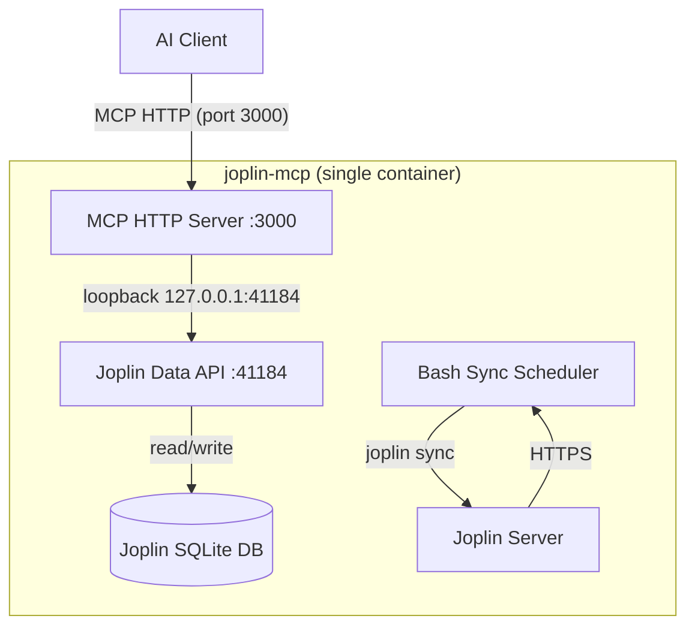

# Joplin API MCP Server

An MCP (Model Context Protocol) server that exposes Joplin's note-taking functionality — notes, folders, tags, search, and sync — to AI assistants via 17 tools.

## tl;dr / Quick Start

### Docker (recommended)

The recommended deployment uses a single container ([`joplin-mcp`](#architecture)) orchestrated via [`docker-compose.yml`](docker-compose.yml):

```bash
cp .env.example .env   # fill in required variables
docker compose up -d   # starts the combined container with healthchecks
```

Add this to your MCP client config:

```json
{
  "mcpServers": {
    "joplin": {
      "url": "http://localhost:3000/mcp"
    }
  }
}
```

> `joplin-mcp` exposes an HTTP endpoint on port 3000 (not stdio). See [MCP Client Configuration](#mcp-client-configuration) for other setups.

### Native Installation

For local development or without Docker, the MCP HTTP server ([`src/mcp/entry.ts`](src/mcp/entry.ts)) connects to a running Joplin Data API:

```bash
git clone <repo-url> && cd joplin-api
cp .env.example .env   # fill in JOPLIN_API_TOKEN and JOPLIN_CORE_URL
pnpm install
pnpm build && pnpm start
```

MCP client config (HTTP):

```json
{
  "mcpServers": {
    "joplin": {
      "url": "http://localhost:3000/mcp"
    }
  }
}
```

---

## ⚠️ Important: Two Different Tokens — Do Not Mix

This project involves **two different Joplin tokens** that must not be confused:

| Token                            | Where to find it                                                             | What it's used for                                                                                      |
| -------------------------------- | ---------------------------------------------------------------------------- | ------------------------------------------------------------------------------------------------------- |
| **Data API token** (`api.token`) | Auto-extracted by the entrypoint on startup (or set via `JOPLIN_API_TOKEN` in `.env`) | Authenticate requests to the Joplin ClipperServer Data API (used as `JOPLIN_API_TOKEN` in this project) |
| **Web Clipper token**            | Joplin desktop → _Web Clipper → Options_ (shown in the browser extension UI) | Authenticate the Web Clipper browser extension — **this is NOT the same token**                         |

> **⚠️ Do NOT use the Web Clipper token from the Joplin frontend as your `JOPLIN_API_TOKEN`.** They are different values, and using the wrong one will cause authentication failures. In Docker, the token is auto-extracted inside the container — no manual retrieval needed.

There is also a short-lived **session token** (`auth_token`) that the MCP server obtains automatically at runtime via `POST /auth` — you never need to set or manage this token yourself.

---

## ⚠️ End-to-End Encryption (E2EE)

If you have **End-to-End Encryption (E2EE)** enabled on your Joplin Server, the container must know the **master password** before it can encrypt notes for upload. Without it, writes appear to succeed locally but **silently fail to reach the server** — and the sync process will misleadingly report `SYNC_PASS`.

### What E2EE means

When E2EE is enabled, Joplin encrypts all note content on the client before sending it to the server. The server only ever sees ciphertext — decryption happens client-side using the master password. This project's container acts as such a client, so it must have the master password configured.

### Setting the master password

After starting the container for the first time (or after enabling E2EE on Joplin Server), run:

```bash
# Set the master password inside the joplin-mcp container
docker exec joplin-mcp joplin config encryption.masterPassword 'THE_PASSWORD'

# Restart so the new config is picked up
docker restart joplin-mcp
```

Replace `THE_PASSWORD` with the same master password used when enabling E2EE on Joplin Server (or the one you chose if you enabled it from the CLI).

> **Tip:** This only needs to be done once — the password is persisted in the `joplin_data` Docker volume.

### ⚠️ Warning: `joplin e2ee decrypt` does NOT persist the password

The command `joplin e2ee decrypt -p 'PASSWORD'` decrypts data **for the current session only** and does **not** store the password for future sync operations. Using it as your setup step will cause encrypted items to silently fail to upload on subsequent syncs. Always use `joplin config encryption.masterPassword` instead.

### How to tell if E2EE is the problem

If you notice notes are missing from Joplin Server despite the container reporting `SYNC_PASS`, check whether E2EE is enabled on the server and whether the master password has been configured in the container.

---

## Detailed How-To

### Direct Installation

#### Prerequisites

- **Node.js** 20 or later (the project's [`package.json`](package.json) `engines` field requires `>=22.0.0`)
- **[pnpm](https://pnpm.io/)** 9 or later (for package management)
- **Joplin desktop app** running with the **Data API (ClipperServer)** enabled:
  - In Joplin: _Web Clipper → Options → Enable Clipper Server_
  - The server binds to `127.0.0.1:41184` by default and ignores `--host`/`--port` flags
- **Joplin Server** (optional but recommended) — a sync target for multi-device synchronisation. Without it, write-through sync will fail and notes remain local-only

#### Installation

```bash
git clone <repo-url>
cd joplin-api
pnpm install
pnpm build
```

#### Configuration

Copy the environment template and fill in your values:

```bash
cp .env.example .env
```

All configuration is done via environment variables:

| Variable                | Required | Default | Description                                                            |
| ----------------------- | -------- | ------- | ---------------------------------------------------------------------- |
| `JOPLIN_SERVER_URL`     | **Yes**  | —       | Joplin Server URL (e.g., `https://joplin.example.com/`)                |
| `JOPLIN_USERNAME`       | **Yes**  | —       | Joplin Server username/email                                           |
| `JOPLIN_PASSWORD`       | **Yes**  | —       | Joplin Server password                                                 |
| `JOPLIN_DATA_API_PORT`  | No       | `41184` | Internal Data API listen port (Joplin ClipperServer hardcoded default) |
| `LOG_LEVEL`             | No       | `info`  | Log level: `debug`, `info`, `warn`, `error`, `silent`                  |
| `SYNC_INTERVAL_SECONDS` | No       | `300`   | Periodic sync interval in seconds                                      |
| `NODE_ENV`              | No       | —       | Set to `production` to enforce HTTPS for `JOPLIN_SERVER_URL`           |

> **Note:** `JOPLIN_API_TOKEN` is the Joplin **Data API token**. In Docker, the token is auto-extracted inside the container from the Joplin CLI config — no manual retrieval needed. You can optionally set it in `.env` to override auto-detection. This is **not** the same as the "Web Clipper token" shown in Joplin's desktop frontend — see [Important: Two Different Tokens](#-important-two-different-tokens--do-not-mix). If running natively without Docker, you must set `JOPLIN_API_TOKEN` manually in your `.env` file.

#### Running the Server

```bash
# Production (compiled)
pnpm build && pnpm start

# Development (hot reload via tsx watch)
pnpm dev
```

The MCP HTTP server connects to a running Joplin Data API (via `JOPLIN_CORE_URL`), validates connectivity, then begins serving MCP requests over HTTP on port 3000 (configurable via `MCP_PORT`).

#### MCP Client Configuration (Native / Node.js)

The MCP HTTP server exposes an **HTTP endpoint** (not stdio). Configure your MCP client to connect via URL:

```json
{
  "mcpServers": {
    "joplin": {
      "url": "http://localhost:3000/mcp"
    }
  }
}
```

#### Testing

```bash
# Run all tests
pnpm test

# Watch mode
pnpm test:watch

# Lint
pnpm lint

# Format
pnpm format
```

Tests use [Vitest](https://vitest.dev/) and cover all modules: config parsing, CLI executor, data client, error classes, sync manager, pagination, MCP schemas, tool handlers, and integration tests against a live Joplin Data API.

### Docker

#### Prerequisites

- **Docker** and **Docker Compose** installed on your system
- The [`.env.example`](.env.example) file copied to `.env` and configured with your Joplin Server credentials

The deployment uses a single combined Dockerfile ([`Dockerfile.combined`](Dockerfile.combined)) orchestrated via [`docker-compose.yml`](docker-compose.yml).

#### Building

```bash
# Build the combined container
docker compose build
```

#### Running

```bash
docker compose up -d   # starts the combined joplin-mcp container
```

#### Viewing Logs

```bash
docker compose logs -f              # combined container logs
docker compose logs -f joplin-mcp   # same (single service)
```

#### Stopping

```bash
docker compose down
```

#### Environment Variables

Place variables in the `.env` file (automatically picked up by [`docker-compose.yml`](docker-compose.yml)).

| Variable                | Required | Default | Description                                                              |
| ----------------------- | -------- | ------- | ------------------------------------------------------------------------ |
| `JOPLIN_SERVER_URL`     | **Yes**  | —       | Joplin Server URL (e.g., `https://joplin.example.com/`)                  |
| `JOPLIN_USERNAME`       | **Yes**  | —       | Joplin Server username/email                                             |
| `JOPLIN_PASSWORD`       | **Yes**  | —       | Joplin Server password                                                   |
| `JOPLIN_API_TOKEN`      | No       | —       | Joplin Data API token (auto-extracted when unset)                        |
| `JOPLIN_DATA_API_PORT`  | No       | `41184` | Internal Data API listen port (rarely changed)                           |
| `MCP_HOST_PORT`         | No       | `3000`  | Host-side MCP port (container always listens on internal port 3000)      |
| `LOG_LEVEL`             | No       | `info`  | Log level: `debug`, `info`, `warn`, `error`, `silent`                    |
| `SYNC_INTERVAL_SECONDS` | No       | `300`   | Periodic sync interval in seconds                                        |
| `NODE_ENV`              | No       | —       | Set to `production` to enforce HTTPS for `JOPLIN_SERVER_URL`             |

> **Note:** `JOPLIN_CORE_URL` is no longer an operator-facing variable — the entrypoint sets it internally to `http://127.0.0.1:41184`. If `MCP_PORT` is present in `.env`, the entrypoint canonicalizes it to `3000` with a warning (use `MCP_HOST_PORT` for host-side mapping instead).

#### MCP Client Configuration (Docker)

The `joplin-mcp` container exposes an **HTTP endpoint** (not stdio). Configure your MCP client to connect via URL:

```json
{
  "mcpServers": {
    "joplin": {
      "url": "http://localhost:3000/mcp"
    }
  }
}
```

#### How It Works

- **Single container**: `joplin-mcp` — one combined container runs the Joplin CLI + Data API (loopback-only), a bash periodic-sync loop, and the Node.js MCP HTTP server
- **Multi-stage builds**: [`Dockerfile.combined`](Dockerfile.combined) uses `node:22-bookworm-slim` with separate build and production stages
- **Non-root user**: `joplin` user (uid 1001) for all processes
- **Persistent volume**: `joplin_data` volume mounted at `/home/joplin/.config/joplin` stores the Joplin profile and SQLite database
- **Loopback-only Data API**: The Data API binds to `127.0.0.1:41184` inside the container — no socat, no port proxy
- **Published port**: Only port 3000 (MCP) is mapped to the host via `127.0.0.1:${MCP_HOST_PORT:-3000}:3000`
- **Healthchecks**: The container healthcheck probes both `127.0.0.1:41184/ping` (Data API) and `127.0.0.1:3000/health` (MCP server)
- **Graceful shutdown**: The entrypoint traps `SIGTERM`, drains the sync loop process group, stops the MCP server, performs a final sync, and exits cleanly

#### Testing with Docker

A dedicated [`Dockerfile.tests`](Dockerfile.tests) and `test` service in [`docker-compose.yml`](docker-compose.yml) allow running the test suite in a container:

```bash
# Build the test image
docker build -f Dockerfile.tests -t joplin-api-tests .

# Run tests
docker run --rm joplin-api-tests

# Or via docker compose (requires --profile test since the test service uses profiles)
docker compose --profile test run --rm tests
```

Tests use [Vitest](https://vitest.dev/) with v8 coverage (thresholds: 70% statements, 60% branches, 70% functions, 70% lines) and output JUnit XML reports to `./reports/`. When running via docker compose, the `./reports` directory is mounted into the container so reports persist on the host.

The test suite does not require a running Joplin instance — unit tests use mocks, and integration tests are skipped when the Joplin Data API is unavailable.

### Container Integration Tests

End-to-end tests that run the full MCP stack in Docker containers using the **integration-test stack** ([`docker-compose.test.yml`](docker-compose.test.yml)), which retains the two-container topology (`joplin-core` + `joplin-mcp`).

#### Prerequisites

- Docker and Docker Compose v2

#### Running

```bash
make test-integration
# or
./scripts/run-integration-tests.sh
```

#### What it tests

- MCP connection and tool discovery (17 tools)
- Note CRUD via MCP tools
- Folder CRUD via MCP tools
- Search and tag operations
- Error handling and validation

#### Architecture

Tests connect to `joplin-mcp` via `@modelcontextprotocol/sdk` StreamableHTTP transport.
`joplin-core` runs with dummy sync credentials — no real Joplin Server is needed.
The API token is extracted from a shared Docker volume at startup.

The integration-test stack uses `Dockerfile.core`, `Dockerfile.mcp`, `entrypoint-core.sh`, `entrypoint-mcp.sh`, and `scripts/extract-api-token.sh` — these files are **retained exclusively for the test stack** and are not used in production.

#### Reports

- JUnit XML: `reports/container/junit.xml`
- Container logs: `reports/container/*.log`

---

## Architecture

### Single-Container Deployment (Docker)


```mermaid
graph TD
    A[AI Client] -->|"MCP HTTP (port 3000)"| B[joplin-mcp container]
    subgraph "joplin-mcp (single container)"
        B[MCP HTTP Server :3000]
        C[Joplin Data API :41184] -->|"read/write"| D[(Joplin SQLite DB)]
        E[Bash Sync Scheduler] -->|"joplin sync"| F[Joplin Server]
        F -->|"HTTPS"| E
    end
    B -->|"loopback 127.0.0.1:41184"| C
```

1. **AI Client** connects to **joplin-mcp** via HTTP on port 3000 (MCP StreamableHTTP transport)
2. **joplin-mcp** is a **single container** that runs both the stateless MCP HTTP server and the stateful Joplin Data API + sync scheduler
3. **JoplinDataClient** in the MCP server issues HTTP requests to the **Data API** over loopback (`127.0.0.1:41184`) — no network proxy needed
4. **Data API** binds to `127.0.0.1:41184` (loopback-only) inside the container, backed by a persistent SQLite volume
5. **Bash sync scheduler** handles periodic sync via the Joplin CLI against Joplin Server
6. Write operations from the MCP server trigger sync via the Data API; bash scheduler provides periodic backup sync
7. The container uses a **single healthcheck** probing both the Data API (`/ping`) and the MCP server (`/health`)

> **Note: SQLITE_BUSY during sync** — During periodic sync windows, the Joplin CLI holds a
> write lock on the SQLite database, which can cause transient `SQLITE_BUSY` errors for
> concurrent read requests from the MCP server. The MCP server automatically retries read
> (GET) requests on `SQLITE_BUSY` with exponential backoff (up to 3 retries). Write requests
> (POST/PUT/DELETE) are **not** retried to avoid duplicate resource creation. This is an
> inherent limitation of the two-process architecture (Data API + sync CLI sharing one
> SQLite database), now running within a single container. The long-term fix is a single
> long-lived process ([GitHub Issue #2, Topic 6](https://github.com/gelse/joplin-mcp/issues/2)).

#### Migration from Two-Container Setup

If migrating from the previous two-container deployment:

1. **Rename `MCP_PORT` → `MCP_HOST_PORT`** in your `.env` file (if set)
2. **Remove `JOPLIN_CORE_URL`** from `.env` (no longer operator-facing; set automatically by the entrypoint)
3. **Stop the old stack and bring up the new one**: `docker compose down && docker compose up -d`
4. **Volumes carry over** — the `joplin_data` volume and uid 1001 are unchanged; your existing notes, E2EE master password, and sync config survive the migration

## Available MCP Tools

### Tool Overview

| Tool             | Description                                    | Writes? |
| ---------------- | ---------------------------------------------- | ------- |
| `list_notebooks` | List all notebooks/folders                     | No      |
| `list_notes`     | List notes with pagination and metadata fields | No      |
| `search_notes`   | Search notes, folders, and tags                | No      |
| `read_note`      | Read a single note by ID                       | No      |
| `read_notebook`  | Read a single notebook by ID                   | No      |
| `read_multinote` | Read multiple notes by IDs                     | No      |
| `read_tags`      | Get tags for a note                            | No      |
| `create_note`    | Create a new note                              | **Yes** |
| `create_folder`  | Create a new notebook                          | **Yes** |
| `edit_note`      | Edit an existing note                          | **Yes** |
| `edit_folder`    | Edit an existing folder                        | **Yes** |
| `create_tag`     | Create a new tag                               | **Yes** |
| `tag_note`       | Apply a tag to a note                          | **Yes** |
| `untag_note`     | Remove a tag from a note                       | **Yes** |
| `delete_note`    | Delete a note                                  | **Yes** |
| `delete_folder`  | Delete a folder                                | **Yes** |
| `sync`           | Manually trigger sync                          | No      |

### Input / Output Schemas

All tool input is validated through [Zod](https://zod.dev/) schemas. Below are the expected input fields and return types.

#### Read Tools

| Tool             | Input                                                                  | Output                                            |
| ---------------- | ---------------------------------------------------------------------- | ------------------------------------------------- |
| `list_notebooks` | `{}`                                                                   | `Folder[]`                                        |
| `list_notes`     | `{ limit?: number (1–100), page?: number (≥1) }`                       | `{ items: Note[], has_more: boolean }`            |
| `search_notes`   | `{ query: string (1–1000 chars), type?: "note" \| "folder" \| "tag" }` | `SearchResult[]`                                  |
| `read_note`      | `{ note_id: string (32-char hex) }`                                    | `Note`                                            |
| `read_notebook`  | `{ notebook_id: string (32-char hex) }`                                | `Folder`                                          |
| `read_multinote` | `{ note_ids: string[] (array of 32-char hex IDs) }`                    | `{ notes: Note[], errors: { note_id, error }[] }` |
| `read_tags`      | `{ note_id: string (32-char hex) }`                                    | `Tag[]`                                           |

> **⚠️ Known limitation: `search_notes` returns empty results for notes created/edited via the Data API.** Joplin's `/search` endpoint reads from a SQLite full-text-search (FTS) index that the headless CLI (`joplin server start`) does **not** build or update. Notes created/edited via the Data API remain readable through `list_notes`/`read_note` but are **not findable** through `search_notes`. This is a known upstream Joplin issue: <https://github.com/laurent22/joplin/issues/11631>. Until it is resolved, do not rely on `search_notes` to locate recently-written notes — use `list_notes` and filter client-side instead.

#### Write Tools

| Tool            | Input                                                                                                                                                          | Output              |
| --------------- | -------------------------------------------------------------------------------------------------------------------------------------------------------------- | ------------------- |
| `create_note`   | `{ title (1–500 chars), parent_id?, body? (max 1 MB), author? (max 200), source_url? (validated URL), is_todo? (boolean \| number 0/1), todo_due? (unix ms) }` | `Note`              |
| `create_folder` | `{ title (1–500 chars), parent_id?, icon? (max 100) }`                                                                                                         | `Folder`            |
| `edit_note`     | `{ note_id, title?, parent_id?, body?, author? (max 200), source_url? (validated URL), is_todo? (boolean \| number 0/1), todo_due? (unix ms) }`                | `Note`              |
| `edit_folder`   | `{ folder_id, title?, parent_id?, icon? (max 100) }`                                                                                                           | `Folder`            |
| `create_tag`    | `{ title (1–200 chars) }`                                                                                                                                      | `Tag`               |
| `tag_note`      | `{ note_id, tag_id }`                                                                                                                                          | `NoteTag`           |
| `untag_note`    | `{ note_id, tag_id }`                                                                                                                                          | `{ success: true }` |

#### Delete Tools

| Tool            | Input           | Output              |
| --------------- | --------------- | ------------------- |
| `delete_note`   | `{ note_id }`   | `{ success: true }` |
| `delete_folder` | `{ folder_id }` | `{ success: true }` |

#### Sync Tool

| Tool   | Input | Output                                                          |
| ------ | ----- | --------------------------------------------------------------- |
| `sync` | `{}`  | `{ status: "idle" \| "syncing", lastSyncTime: string \| null }` |

### Error Response Format

When a tool execution fails, the MCP server returns a response with `isError: true` and a `content` array containing a single text entry:

```json
{
  "content": [{ "type": "text", "text": "Error message describing the failure" }],
  "isError": true
}
```

**Validation errors** (Zod schema mismatch) are logged at `warn` level and include the specific field path and reason, for example:

```
Validation error: note_id: Expected 32-character hex ID
```

**Execution errors** (API failures, timeouts, etc.) are logged at `error` level and include the tool name and error message. See the [Error Handling](#error-handling) section for the full error class hierarchy.

## Sync Behaviour

- **Initial sync**: Runs on startup via SyncManager before accepting MCP requests
- **Periodic sync**: Every 5 minutes (configurable via `SYNC_INTERVAL_SECONDS`)
- **Write-triggered sync**: After every create/update/delete/untag operation (immediate, blocking until sync completes)
- **Conflict resolution**: Remote always wins (Joplin CLI built-in behaviour; conflicted copies are flagged in Joplin)
- **Serialized queue**: Prevents `SQLITE_BUSY` errors by serializing sync operations

## Security Considerations

### Token Management

> **⚠️ Reminder:** `JOPLIN_API_TOKEN` is the Data API token (auto-extracted by the entrypoint or set via `.env`), **not** the Web Clipper token from the Joplin frontend. See [Important: Two Different Tokens](#-important-two-different-tokens--do-not-mix) for details.

The Joplin Data API uses **two layers of token authentication**:

1. **API token** (`JOPLIN_API_TOKEN`) — a static token passed as a query parameter (`?token=...`) to every Data API request. Auto-extracted from the Joplin CLI config on startup, or set via `.env`
2. **Session token** (`auth_token`) — a short-lived token (~55 minutes) obtained automatically on startup via `POST /auth`. Used as a `Bearer` token in the `Authorization` header

The session token is managed by [`JoplinDataClient`](src/data-client.ts) and stored in a [`GuardedString`](src/guarded-string.ts) wrapper:

- **`GuardedString`** stores the raw value in a private `#value` field, making it inaccessible through `toString()`, `toJSON()`, or template-literal coercion — all such operations return `'[REDACTED]'`
- The only way to access the actual value is via the explicit `.value` property
- This prevents accidental leakage through logging, serialisation, or error messages
- Tokens are proactively refreshed 60 seconds before expiry and re-fetched automatically on 401 responses

### TLS Requirements for Production

- The Joplin Data API always binds to `127.0.0.1` (localhost-only inside the container), so TLS between the MCP server and the Data API is unnecessary — traffic never leaves the container
- **The Joplin Server URL (`JOPLIN_SERVER_URL`) must use HTTPS in production** — this is enforced by the config schema (see [`src/config.ts`](src/config.ts#L5)). HTTP is only allowed when `NODE_ENV` is not set to `production`
- Joplin CLI sync traffic to Joplin Server is plain HTTP by default; ensure your Joplin Server is deployed behind a TLS-terminating reverse proxy

### Localhost-Only Defaults

- The Data API binds to `127.0.0.1:41184` (loopback-only) inside the container — it is unreachable from outside the container
- Only **port 3000** (MCP) is published to the host, bound to `127.0.0.1` — it is only accessible from the local machine
- The Data API is never exposed to the Docker network or the host — all MCP→Data API communication happens over loopback within the container

### Token Rotation Best Practices

- The Joplin Data API issues tokens with a configurable expiry (default ~55 minutes, controlled by the Joplin Data API server)
- The client automatically refreshes the token before expiry and on 401 responses
- If a token compromise is suspected, rotate the Joplin Server credentials (`JOPLIN_PASSWORD`) and restart the container — a new token will be issued on the next `POST /auth` call

### CLI Argument Sanitization

All Joplin CLI subcommands executed via [`CliExecutor`](src/cli-executor.ts) are protected by two layers of defence:

1. **Subcommand whitelist** — Only a predefined set of subcommands (sync, config, ls, cat, etc.) is allowed. Unknown subcommands are rejected before execution
2. **Shell metacharacter blocking** — Arguments containing `;`, `|`, `&`, `$`, `` ` ``, `(`, `)`, `{`, `}`, `<`, `>`, `\n` are rejected

These checks are defence-in-depth on top of Node.js `execFile`, which does not spawn a shell.

## Error Handling

```
Error
├── ConfigError              # Missing/invalid environment variables
├── CliError                 # Joplin CLI subprocess failure
│   └── Properties: result { stdout, stderr, exitCode }
├── DataApiError             # Joplin Data API HTTP error
│   ├── statusCode: number
│   ├── responseBody?: string
│   ├── NotFoundError (404)  # Resource not found
│   ├── ConflictError (409)  # Resource modified since fetch
│   ├── ValidationError (400)# Invalid input
│   └── AuthError (401)      # Authentication failed
└── FatalError               # Fatal/unexpected error
    ├── cause?: unknown
    └── exitCode: number (default 1)
```

## Rate Limiting

The internal Joplin Data API HTTP client (`JoplinDataClient`) enforces a configurable concurrency limit to prevent overwhelming the Data API process:

- **Default max concurrency**: 5 concurrent requests
- **Configurable via**: `maxConcurrency` constructor parameter on `JoplinDataClient`
- **Behaviour**: When the limit is reached, additional requests are queued and executed as soon as a slot becomes available
- **Scope**: All Data API calls (list, get, create, update, delete, search) share the same concurrency pool
- **Per-tool**: Individual tool calls make a single Data API request, so concurrency is only relevant under parallel MCP requests

## Troubleshooting

### Authentication Failures

**Symptom**: MCP tools return `"Authentication failed"` or `AuthError`.

**Causes and fixes:**

| Cause                               | Fix                                                                                                                                    |
| ----------------------------------- | -------------------------------------------------------------------------------------------------------------------------------------- |
| Invalid `JOPLIN_PASSWORD` in `.env` | Verify the password matches your Joplin Server account                                                                                 |
| Token expired before refresh        | Check that the system clock is synchronised (NTP). The client refreshes tokens proactively, but clock drift can cause premature expiry |
| Joplin Server unreachable           | Ensure `JOPLIN_SERVER_URL` is correct and the server is running. Verify TLS certificate if using HTTPS                                 |
| Data API not ready                  | Wait for the "Data API is healthy" log line before sending requests                                                                    |

**Diagnostic steps:**

1. Check container logs: `docker compose logs`
2. Look for entries containing `"Failed to obtain Joplin API token"` or `"AuthError"`
3. Verify credentials by curling the Joplin Server API directly

### Sync Conflicts

**Symptom**: Logs contain `"Sync conflicts detected — remote version retained"` warnings.

**Behaviour**: The system uses a **remote-wins** conflict resolution strategy. Local changes always yield to remote versions.

**What to do:**

- Conflict notes are flagged in Joplin as conflicted copies. Check for them using the Joplin desktop/client app
- You can programmatically check conflict count via `CliExecutor.checkConflicts()`
- To resolve, review the conflicted notes in Joplin and manually merge or delete them

### Timeout Issues

**Symptom**: CLI commands fail with `"joplin CLI timed out after Nms"`.

**Causes and fixes:**

| Cause                                     | Fix                                                                                                             |
| ----------------------------------------- | --------------------------------------------------------------------------------------------------------------- |
| Large initial sync (many notes/resources) | Increase `SYNC_INTERVAL_SECONDS` or let the initial sync complete — subsequent syncs are incremental            |
| Joplin Server slow to respond             | Check Joplin Server performance (CPU, memory, database). Ensure network latency is low                          |
| CLI command timeout too short             | The default timeout is 60 seconds; for extremely large operations, this can be adjusted in `CliExecutor.exec()` |

### CLI Execution Errors

**Symptom**: `CliError` with exit code, stdout, and stderr details.

**Common causes:**

- **Missing `joplin` binary**: The `joplin` CLI must be installed in the container and available on `PATH`. The Dockerfile handles this, but verify if using a custom setup
- **Config not set**: The entrypoint script configures `sync.target 10` and server credentials. If skipped, `joplin sync` will fail with a configuration error
- **Permission errors**: Ensure the Joplin CLI config directory (`~/.config/joplin`) is writable

### Rate Limiting

**Symptom**: Requests are queued or take longer than expected, but no errors are thrown.

**Behaviour**: The `JoplinDataClient` enforces a maximum of 5 concurrent API requests (configurable). Additional requests are queued and processed sequentially as slots open up.

**If you hit concurrency limits:**

- Reduce the number of parallel MCP tool calls from your AI client
- The concurrency limit is a constructor parameter on `JoplinDataClient` in [`src/data-client.ts`](src/data-client.ts). Increase it if you have a specific need for higher parallelism, but be aware of the Data API's own capacity

## Development

### Commands

```bash
pnpm install          # Install dependencies
pnpm dev              # Run in development mode with hot reload (tsx watch)
pnpm build            # Compile TypeScript (tsc)
pnpm start            # Run compiled server (node dist/mcp/entry.js)
pnpm test             # Run tests (vitest)
pnpm test:watch       # Run tests in watch mode
pnpm lint             # Lint source code (eslint)
pnpm format           # Format source code (prettier --write)
```

## Project Structure

```
src/
├── config.ts              # Zod-based environment config parsing
├── logger.ts              # Pino structured logger
├── cli-executor.ts        # Joplin CLI subprocess wrapper
├── sync-manager.ts        # Serialized sync queue orchestrator
├── data-client.ts         # Joplin Data API HTTP client (26 methods, token auth)
├── api-types.ts           # TypeScript type definitions for Joplin API
├── errors.ts              # Typed error class hierarchy
├── guarded-string.ts      # Secure string wrapper (prevents accidental secret leakage)
├── pagination.ts          # Pagination helpers (clampLimit, fetchAllPages)
└── mcp/
    ├── entry.ts           # MCP HTTP server entrypoint
    ├── server.ts          # MCP server setup (stdio + StreamableHTTP transport)
    ├── schemas.ts         # Zod validation schemas for all 17 tools
    ├── tools.ts           # 17 tool handler implementations
    └── tool-registry.ts   # Tool registration and dispatch
tests/
├── cli-executor.test.ts   # CLI executor tests
├── config.test.ts         # Config parser tests
├── data-client.test.ts    # Data API client tests
├── errors.test.ts         # Error class hierarchy tests
├── integration.test.ts    # Integration tests against live Joplin Data API
├── logger.test.ts         # Logger tests
├── pagination.test.ts     # Pagination helper tests
├── sync-manager.test.ts   # Sync manager tests
└── mcp/
    ├── schemas.test.ts     # Zod schema validation tests
    ├── server.test.ts      # MCP server lifecycle tests
    ├── tool-registry.test.ts # Tool registration & dispatch tests
    └── tools.test.ts       # Tool handler tests
docs/                      # Project documentation (see root SBOM.md for dependency inventory)
scripts/
└── smoke-test.sh          # Docker container smoke test (checks container up + Data API /ping)
```

Root-level deployment files:

| File                                         | Purpose                                                                          |
| -------------------------------------------- | -------------------------------------------------------------------------------- |
| [`Dockerfile.combined`](Dockerfile.combined) | Production: combined Joplin CLI + Data API + MCP HTTP server                     |
| [`Dockerfile.tests`](Dockerfile.tests)       | Test runner container                                                            |
| [`entrypoint-combined.sh`](entrypoint-combined.sh) | Production entrypoint: Data API + sync loop + MCP server with graceful shutdown |
| [`docker-compose.yml`](docker-compose.yml)   | Single-service orchestration with healthchecks                                   |
| [`docker-compose.test.yml`](docker-compose.test.yml) | Integration-test stack (two-container topology, used by `make test-integration`) |

The following files are **retained for the integration-test stack only** and are not used in production:

| File                                         | Purpose                                                          |
| -------------------------------------------- | ---------------------------------------------------------------- |
| [`Dockerfile.core`](Dockerfile.core)         | Test-stack Container A: Joplin CLI + Data API                    |
| [`Dockerfile.mcp`](Dockerfile.mcp)           | Test-stack Container B: stateless MCP HTTP server                |
| [`entrypoint-core.sh`](entrypoint-core.sh)   | Test-stack Container A entrypoint                                |
| [`entrypoint-mcp.sh`](entrypoint-mcp.sh)     | Test-stack Container B entrypoint                                |
| [`scripts/extract-api-token.sh`](scripts/extract-api-token.sh) | Test-stack token extraction from shared volume |

## Startup & Shutdown Pipeline

### Production (Single Container)

**Combined joplin-mcp container ([`entrypoint-combined.sh`](entrypoint-combined.sh)):**

1. **Validate environment variables** — Checks `JOPLIN_SERVER_URL`, `JOPLIN_USERNAME`, `JOPLIN_PASSWORD`
2. **Configure Joplin CLI** — Sets `sync.target 10` and server credentials in Joplin CLI config
3. **Extract API token** — Honours a pre-set `JOPLIN_API_TOKEN` from `.env`, or auto-extracts from the Joplin CLI config / `settings.json`
4. **Start Joplin Data API** — `joplin server start` binding to `127.0.0.1:41184` (loopback-only, no socat proxy)
5. **Wait for readiness** — Polls `/ping` endpoint (up to 30 retries, 2s intervals)
6. **Perform initial sync** — `joplin sync` with sync-error diagnostics
7. **Start periodic sync** — Bash `while true` loop (runs in its own process group via `setsid`) with configurable `SYNC_INTERVAL_SECONDS`
8. **Start MCP HTTP server** — `node dist/mcp/entry.js` on port 3000
9. **Liveness monitor** — `wait -n` on both child PIDs; exits non-zero if either dies (triggers Docker restart)
10. **Handle signals** — On `SIGTERM`/`SIGINT`: kill sync loop group, stop MCP server, stop Data API, perform final sync, exit 0

### Integration-Test Stack (Two Containers)

The integration-test stack ([`docker-compose.test.yml`](docker-compose.test.yml)) retains the original two-container topology using [`entrypoint-core.sh`](entrypoint-core.sh) and [`entrypoint-mcp.sh`](entrypoint-mcp.sh). This is used exclusively by `make test-integration`.

## Key Design Decisions

1. **Data API over CLI for data operations** — Avoids fragile CLI output parsing; uses structured HTTP API with typed responses
2. **Single combined container for production** — All components (Data API, MCP server, sync scheduler) run in one container. Communication happens over loopback (`127.0.0.1:41184`), eliminating the need for Docker internal networking or a socat proxy. Only port 3000 is published to the host.
3. **Two-container topology retained for integration tests** — The stateful/stateless split is preserved in the test stack (`docker-compose.test.yml`) because the tests exercise the split (MCP server connecting to a separate Data API container). This also preserves the design history.
4. **Bash-based sync scheduler** — Replaces the TypeScript SyncManager with a simple, reliable bash `while true` loop. Logs every sync with PASS/FAIL to `/var/log/joplin/sync.log`.
5. **Write-through sync** — Write tools trigger immediate sync so Joplin Server is always up-to-date
6. **Serialized sync queue** — Prevents concurrent sync calls causing `SQLITE_BUSY` errors
7. **Remote-wins conflict resolution** — Delegated to Joplin CLI built-in behaviour; local changes always yield to remote
8. **Token lifecycle** — Auth token obtained via `POST /auth`, reused with 60-second proactive refresh buffer before 55-minute expiry, re-fetched on 401 responses
9. **Token auto-extraction** — The entrypoint extracts the API token from the Joplin CLI config, eliminating the manual `docker logs` retrieval ceremony

## License

MIT
